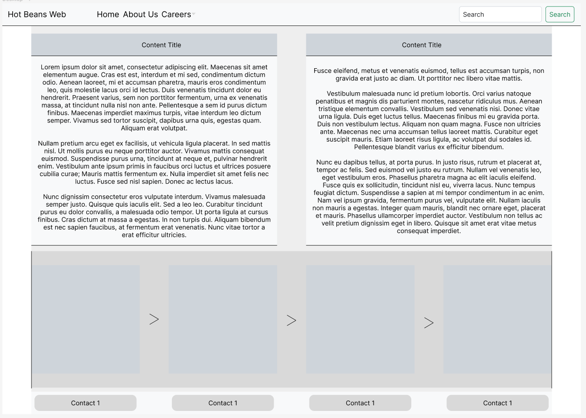
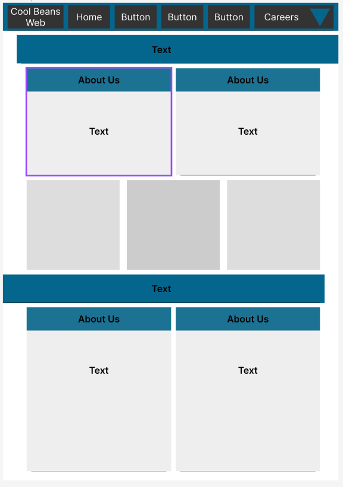

# Design

## Project

The Figma project is located inside a the path: "../../assets"

## Screenshot

## Link

In case of any errors- a link is provided  to the design on the Figma website. Permission to view this would be required, but it is the same design given as a file (that can be opened on Figma) and the SS below. Note that I have not designed the contents of every page, just the colours; fonts and default layout the page will follow.

<https://www.figma.com/file/rSbnGeapGB7sUsT4PWYn4Q/HBW2?type=design&node-id=0-1&t=dmeSR9AunrWcqsS3-0>

## Alternative Design

